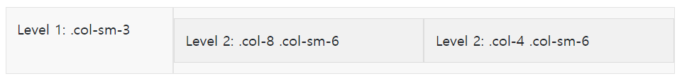

# Bootstrap : Grid System

> **레이아웃을 위한** Bootstrap의 Grid System에 대해 알아본다.


:bulb: Bootstrap의 그리드 시스템은 뷰 포트 크기를 12열로 나누어 레이아웃을 생성한다. 미리 선을 그어놓고 그에 맞춰서 요소들을 배치한다고 생각하면 될 것 같다. 

12열로 나눈 이유는 12의 약수는 1, 2, 3, 4, 6, 12이기 때문에 한 줄에 다양한 크기로 배치할 수 있기 때문이다.


**다음은 Bootstrap에서 그리드 시스템을 적용시키는 방법이다.** :writing_hand:

- `container` 클래스에 콘텐츠를 포함시킨다. `row`를 `container`안에 넣어 정렬과 패딩을 적용시키도록 한다.
  - `container`는 왼쪽과 오른쪽에 기본적으로 `padding`과 `margin`이 적용되어있으며 가운데에 배치되어있다.
- `row` 안의 `col`요소들을 포함시킨다. 이렇게 되면 `col`들은 수평축을 기준으로 정렬이된다. 
  - `row`는 내부적으로 `display: flex`로 되어있다.
- 아래의 코드는 위의 설명을 예시로 보여준다. `col`요소들은 각각 4칸씩을 차지하며 한 줄에 모두 배치된다.

```html
<div class="container">
  <div class="row">
    <div class="col">
      1
    </div>
    <div class="col">
      2
    </div>
    <div class="col">
      3
    </div>
  </div>
</div>
```


**Bootstrap의 그리드 시스템에는 6개의 breakpoint가 존재한다. 이를 통해 반응형 웹을 쉽게 설계할 수 있다.** :hushed:


- `option`에서 `-`다음에 12의 약수 중 하나의 수가 올 수 있다. 예를 들어 `col-md-6`이라고 지정하면 그 요소는 768px이상일 때 6칸을 차지하는 크기가 된다.
- `col-`는 viewport의 크기와 상관없이 모든 크기에 적용되며, 만약 `col-3`이고 `col-xl-12`면 1200px 이상일 때만 12칸을 차지하고 그 외에는 모두 그 요소가 3칸을 차지하게 된다.
- 만약 `col`만 지정해준다면 자동으로 요소의 개수에 맞게 공간에 배치된다. 
- 12칸을 벗어나게 되면 다음 칸에 배치가 되며 이는 `row`에서 `flex-wrap`을 적용시켰기 때문이다.


**`col`의 크기가 아닌 `row`에서 한 줄에 몇 개의 `col`이 오도록 할 것인지 정할 수 있다.** :hushed:

- 다음 코드를 보자. `row-cols-2`를 통해 한 줄에 2개의 요소가 차지하도록 하였다.
- 또한 `row-cols-md-2`로 사용하여 768px이상일 때 한 줄에 2개의 요소가 오도록 할 수 있다.

```html
<div class="container">
  <div class="row row-cols-2">
    <div class="col">1</div>
    <div class="col">2</div>
    <div class="col">3</div>
    <div class="col">4</div>
  </div>
</div>
```


**`col`안에 `row`를 포함시킬 수도 있다.** :stuck_out_tongue_closed_eyes:

- 아래의 코드는 Bootstrap Docs에서 참고한 것이다.
- 첫 번째 `row`에는 두 개의 `colo`이 포함되어있고 두 번째 `col`는 9칸을 차지고 그 안에 `row`를 포함시켰다.
- 또한 그 `row`에 두 개의 `col`을 포함시켰다.

```html
<div class="container">
  <div class="row">
    <div class="col-sm-3">
      Level 1: .col-sm-3
    </div>
    <div class="col-sm-9">
      <div class="row">
        <div class="col-8 col-sm-6">
          Level 2: .col-8 .col-sm-6
        </div>
        <div class="col-4 col-sm-6">
          Level 2: .col-4 .col-sm-6
        </div>
      </div>
    </div>
  </div>
</div>
```



출처: https://getbootstrap.com/docs/5.0/layout/grid/


**각 요소를 배치할 때 공간을 사이에 두고 배치할 수도 있다.** :thumbsup:

- `offset`이 이런 기능을 하고 있는데, `offset-4`를 어떤 요소에 적용시키면 해당요소가 앞에 4칸을 비어두고 그 다음 칸에 배치된다.
- 역시 viewport의 크기에 따라 적용시킬 수도 있다. `offset-lg-4`를 하면 해당 요소는 992px 이상일 때만 4칸을 비어두고 다음에 배치된다.


### :book: **정리** ​

- `Bootstrap`의 **그리드 시스템**은 화면을 수직으로 12개의 선을 그어 각 선에 배치되도록 한다.
- 이를 통해 요소들을 쉽고 일정하게 배치할 수 있으며 **반응형 웹**을 만드는데 수월하다.

 