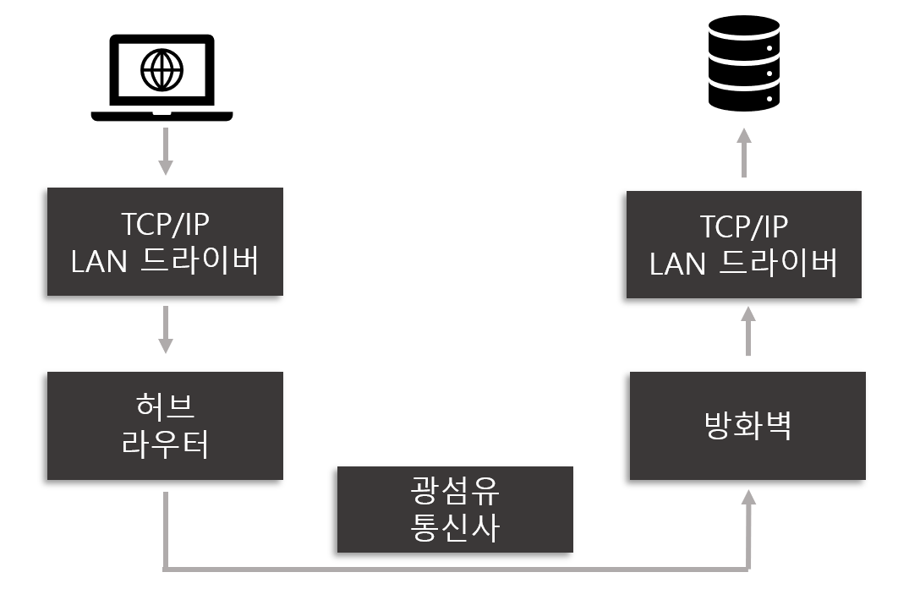

# Intro. 웹 브라우저에 URL을 입력하면 발생하는 일

> 네트워크를 본격적으로 공부하기 전에 전체적인 흐름을 파악하는 것이 중요하다. 공부하는 중간중간 `어디에` `어떻게` 쓰이는지 원리를 정확히 이해할 수 있기 때문이다. 이번에는 웹 브라우저에 URL을 입력하면 어떤 일련의 과정을 거쳐 나에게 보이는지 알아보도록 한다.

다음 그림은 웹 브라우저에 URL을 입력했을 때 발생하는 과정들을 간락화한 그림이다.  

위의 그림에서 일어나는 과정은 다음과 같다.

- 먼저 사용자가 웹 브라우저에 URL을 입력한다.
- 웹 브라우저는 URL을 해석하고 HTTP 메시지를 만들어 Socket 라이브러리에 전달한다.
- TCP는 송신 데이터를 패킷의 길이에 맞게 분할하고 TCP헤더를 추가하여 IP에 전달한다.
- IP는 IP 헤더를 추가하고 MAC 주소를 조사하여 MAC 헤더를 추가한 뒤 LAN 드라이버에 전달한다.
- LAN 드라이버는 LAN 어댑터에 전달하여 송신하도록 명령한다.
- LAN 어댑터에서 패킷을 전기신호로 변환하여 전송 케이블에 전달한다.
- 중간에 라우터와 광섬유로된 케이블을 통해 데이터를 전송한다.
- 웹 서버에 패킷이 도착하면 방화벽에서 패킷을 검사한다.
- 방화벽을 통과 후 IP헤더, TCP헤더를 검사한다.
- HTTP 메시지 조각을 추출하여 본래의 모습으로 되돌린다.
- HTTP 메시지는 Socket 라이브러리를 통해 웹 서버에 전달된다.
- 웹 서버는 HTTP 메시지의 내용을 해석하여 요청한 정보를 전달한다.

※  *네트워크의 기초공부는 "성공과 실패를 결정하는 1%의 네트워크 원리"로 진행합니다.* 